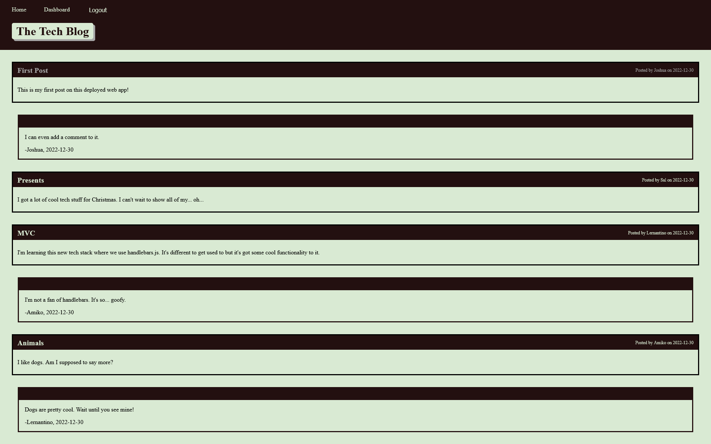

# Tech Blog
## Description

This app allows users to write blog posts to share with other users as well as comment on existing posts.

- My motivation for this app was to be able to make posts about tech and see what others have to say.
- I built this project to understand the MVC framework better.
- This solves the problem of users being able to put their thoughts about tech in a place to share with each other.
- I learned how the front end can interact with the back end in an MVC style app.

## Table of Contents

- [Installation](#installation)
- [Usage](#usage)
- [Credits](#credits)
- [License](#license)
- [Questions](#questions)

## Installation

N/A

## Usage

To post or comment, create an account (found under the login page). After logging in you will be taken to your dashboard. If you click the 'new post' button, you will be able to make a new post. On the homepage, you can click on any post that you see and add a comment to that post.

## Credits

N/A
## License

N/A

## Tests

N/A

## Questions

If you have any questions about this project, [visit my GitHub Profile](https://github.com/TuinderJ/) or [Email Me](mailto:joshua.tuinder@gmail.com)